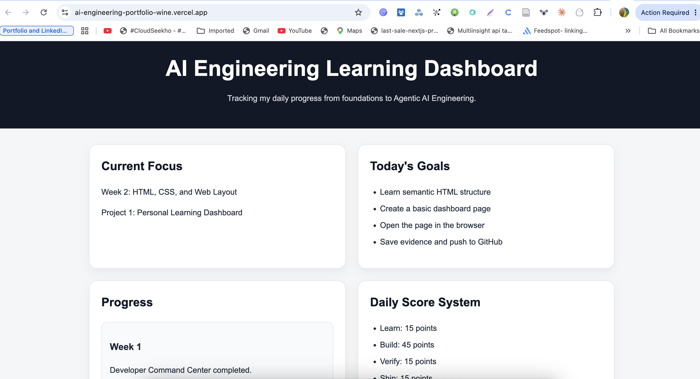

# AI Engineering Portfolio

This repository documents my 32-week project-based journey to become job-ready in AI Engineering, with a focus on LLM applications, RAG, AI agents, tool calling, evaluation, LLMOps, and production-ready systems.

## Goal

Build a strong AI Engineering portfolio through real projects, clean documentation, daily commits, and practical evidence.

## Current Focus

**Week 1:** Developer setup, terminal, Git, GitHub, learning system  
**Project 0:** Developer Command Center

## Portfolio Roadmap

- Project 0: Developer Command Center
- Project 1: Personal Learning Dashboard
- Project 2: Support Ticket UI
- Project 3: Python Automation Toolkit
- Project 4: Full-Stack Support Ticket Dashboard
- Project 5: AI Text Intelligence Assistant
- Project 6: Document Search App
- Project 7: AI Document Intelligence Platform with RAG
- Project 8: AI Support Agent with Tool Calling
- Project 9: Enterprise Agent Memory Hub
- Project 10: MCP-Style Enterprise Tool Hub
- Project 11: Multi-Agent Enterprise Assistant
- Project 12: Enterprise Data Intelligence Copilot
- Project 13: AI Engineering Control Center

## Daily System

Every day I will:

1. Learn one concept
2. Build one small feature or setup step
3. Verify it
4. Commit and push
5. Save evidence
6. Write a short reflection

## Day 1 Evidence

- Developer tools installed
- Version checks completed
- Notes system created
- Evidence folder created
- GitHub repository initialized

## Developer Command Center

This repository is my daily AI Engineering learning system. It tracks my progress from beginner foundations to production-ready AI applications, including RAG, AI agents, tool calling, evaluation, LLMOps, and multi-agent systems.

## Current Phase

**Phase:** Project 0 - Developer Command Center
**Week:** Week 1 - Setup, terminal, Git, VS Code, and learning system
**Goal:** Build a clean daily workflow for learning, building, verifying, documenting, and shipping.

## Week 1 Progress

* [x] Day 1: Developer environment setup
* [x] Day 2: Terminal basics
* [x] Day 3: Git basics
* [x] Day 4: VS Code workflow
* [x] Day 5: Learning system
* [x] Day 6: Mini project setup
* [x] Day 7: Week 1 review

## Daily Score System

| Area    | Points |
| ------- | -----: |
| Learn   |     15 |
| Build   |     45 |
| Verify  |     15 |
| Ship    |     15 |
| Reflect |     10 |
| Total   |    100 |

## Daily Workflow

1. Learn one concept
2. Build one small useful thing
3. Verify it works
4. Save evidence
5. Commit and push to GitHub
6. Write a short reflection

## Proof System

Every day must produce at least one type of proof:

* Notes
* Screenshots
* Git commits
* GitHub updates
* Working code
* Documentation
* Test output
* Demo evidence

## Week 1 Review

In Week 1, I completed Project 0: Developer Command Center.

I set up my developer environment, practiced terminal basics, learned Git basics, configured VS Code, created reusable learning templates, updated the README command center, and saved evidence for each day.

Week 1 proof:

- Developer tools verified
- GitHub repository created
- Daily notes system created
- Evidence folder structure created
- VS Code workspace configured
- README command center added
- Week 1 review completed

## Week 2 Progress

- [x] Day 8: HTML skeleton
- [x] Day 9: CSS layout
- [x] Day 10: Forms
- [x] Day 11: Accessibility
- [x] Day 12: Deployment preview
- [x] Day 13: README proof
- [x] Day 14: Week 2 review

## Live Demo

Personal Learning Dashboard:

[Open Live Dashboard](https://ai-engineering-portfolio-wine.vercel.app/)

## Project 1: Personal Learning Dashboard

A responsive static dashboard built with HTML and CSS to track my AI Engineering learning progress, daily goals, and score system.

### Live Demo

[Open Live Dashboard](https://ai-engineering-portfolio-wine.vercel.app/)

### Screenshot

### What this project shows

- Semantic HTML structure
- Responsive CSS layout
- Card-based dashboard design
- Accessible form labels and focus states
- Keyboard navigation basics
- Deployment with Vercel
- GitHub documentation and proof

### Lessons Learned

This project helped me understand that a portfolio project is not only about writing code. It also needs clear documentation, screenshots, live links, and proof that the project works.

## Week 2 Review

In Week 2, I built Project 1: Personal Learning Dashboard.

I created a semantic HTML structure, added responsive CSS, built a learning task form, improved accessibility, deployed the dashboard to Vercel, and documented the project with a live link and screenshot.

Week 2 proof:

- Semantic HTML dashboard created
- Responsive CSS layout added
- Form UI added
- Accessibility improved
- Live Vercel deployment completed
- README proof added with screenshot and live link
- Week 2 review completed

## Week 3 Progress

- [x] Day 15: Foundation map
- [x] Day 16: Core JavaScript concept 1
- [x] Day 17: Core JavaScript concept 2
- [x] Day 18: Integration day
- [ ] Day 19: Quality day
- [ ] Day 20: Proof day
- [ ] Day 21: Review day
